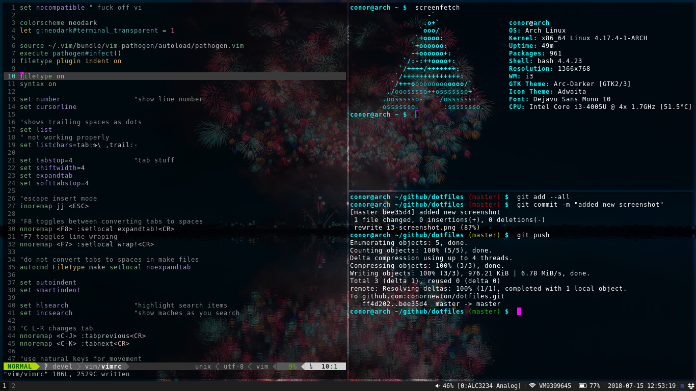

# Dotfiles

Git repository to keep track of all my dot files and sync them across different machines.

My current setup is using:

- Arch Linux
- sway
- i3-blocks
- vim
- termite
- bash

[My vim dotfiles](www.github.com/conornewton/vim-dotfiles)

